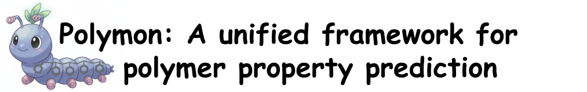

`PolyMon` is a unified framework for polymer property prediction. It is designed to be flexible and easy to use. The framework include various models, featurizers, and different training strategies.

<p align="center">
  
</p>


## Installation
This package requires `torch>=2.2.2` and `torch_geometric>=2.5.3`. We recommend installing these packages manually before installing this package.

```bash
conda install -y pytorch==2.3.0 torchvision==0.18.0 torchaudio==2.3.0 \
                 pytorch-cuda=11.8 -c pytorch -c nvidia
pip install torch_geometric
pip install torch_scatter torch_sparse -f https://data.pyg.org/whl/torch-2.3.0+cu118.html

pip install polymon
```

## Usage
### Train
Train a tabular model or a GNN model for polymer property prediction.
```bash
polymon train --help
```

### Merge
Merge two datasets into one based on different acquisition functions.
```bash
polymon merge --help
```

### Predict
Predict labels for a given dataset.
```bash
polymon predict --help
```

## Citation
To be updated.